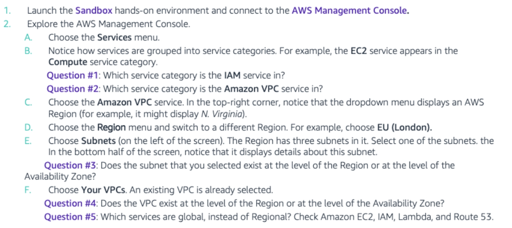

- Q1: IAM -> Security, Identity and Compliance
- Q2: Amazon VPC -> Networking and Contentdelivery
- Q3: Subnets exist at the level of Availibilty Zones
- Q4: VPC exists at the level of a region
- Q5: 
    - IAM global 
    - EC2 regional 
    - route 53 global 
    - lambda regional